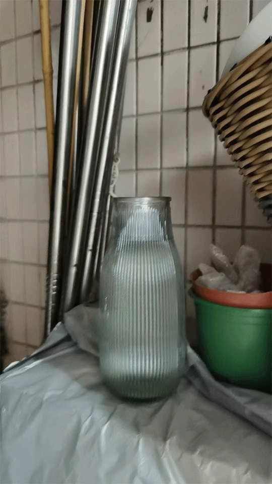
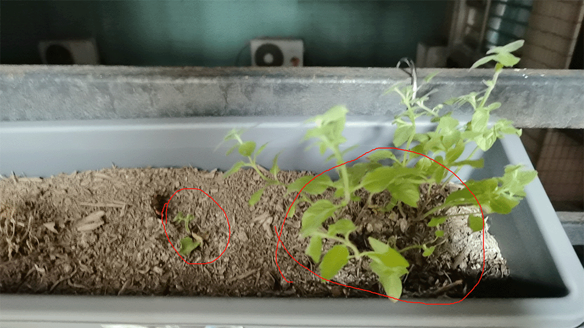
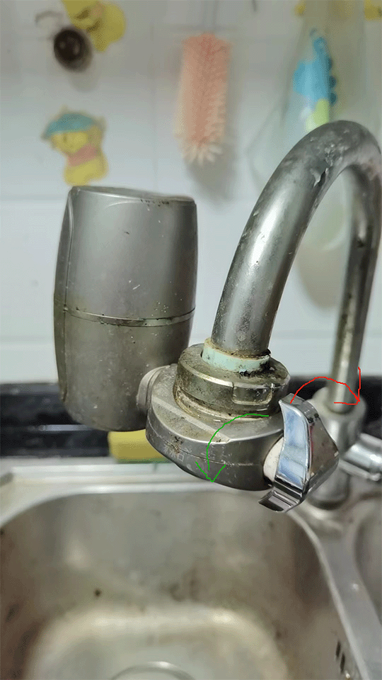

+++
title = "喂猫指北"
date = 2024-07-24
description = "义父！丽塔和薄荷就靠你了！"

[taxonomies]
tags = ["奇怪的指引"]

[extra]
giscus = true
footnote_backlinks = true
quick_navigation_buttons = true
insert_anchor_links = "left"
toc = true
+++

需要照料的包含两部分：**丽塔**和阳台的**薄荷**。

约`3`天上去一次即可（遇到周末等请**酌情调整**）。

## 丽塔篇

饮食习惯：

- 打开猫粮袋子，可以看到有一个量杯：丽塔每日食量约为`1`杯
- 饮水量较大，约为白色水碗一整碗

由于外出时间过长，我还是用马兜（不锈钢盆）盛装了一定的水。

原则上一次添加`2`~`3`杯的猫粮，马兜里放充足的水，同时保证白色水碗装满一整碗（马兜易打翻，作为备用）即可。

如果加水时水碗或者马兜太脏，辛苦简单冲洗一下（丽塔比较挑剔）。

另外洗手间门可以保持常开（丽塔不会偷跑），如果有使用马桶，请及时冲水，以保障马桶内蓄水的清洁度（仍旧为后备）。

## 薄荷篇

打开阳台门可以看到正对的花盆里有薄荷，在右手边的柜子上有一花瓶的水：

每次喂猫时顺便浇水，大概为瓶中容积的`1/4`即可。

浇水时请**避开叶片**，可以选择直接由根部淋湿或淋湿周围土壤（因水珠为凸透镜，叶片易被阳光灼伤）。

薄荷分两株，右手边为母株，左手边为我通过扦插法在近期新栽种的子株：

浇水时，请**雨露均沾**。

## 水源

喂猫或浇花时水不够用怎么办？请去厨房解决：

图示为水龙头附带的净水器：

- 开关向**顺时针**方向（图示红色箭头方向）旋转90°后打开水龙头可出净水，可为丽塔补充饮用水
- 在净水位置上，开关向**逆时针**方向（图示绿色箭头方向）旋转90°后（回复**原位**），打开水龙头可出自来水，可用于洗手、浇花等

> 由于技术原因，净水器开关位于45°的整数倍上将无法正常工作。

**特别注意**：离开厨房时请确保厨房门已关闭。丽塔非常喜欢啃塑料袋，厨房是她的“天堂”。由于门板已受潮，可能无法关严，但请尽量用力拉紧。

## 零食

冰柜上有果冻，请不要客气，等我回去会安排`5`倍浓缩什么的 :)
