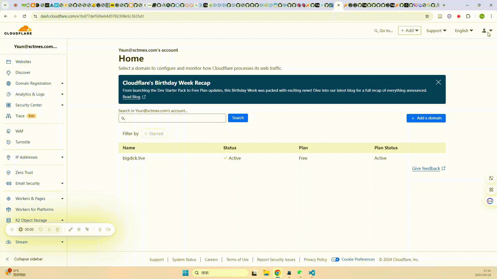
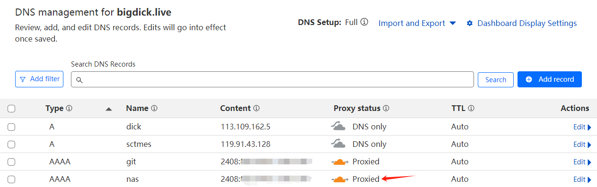
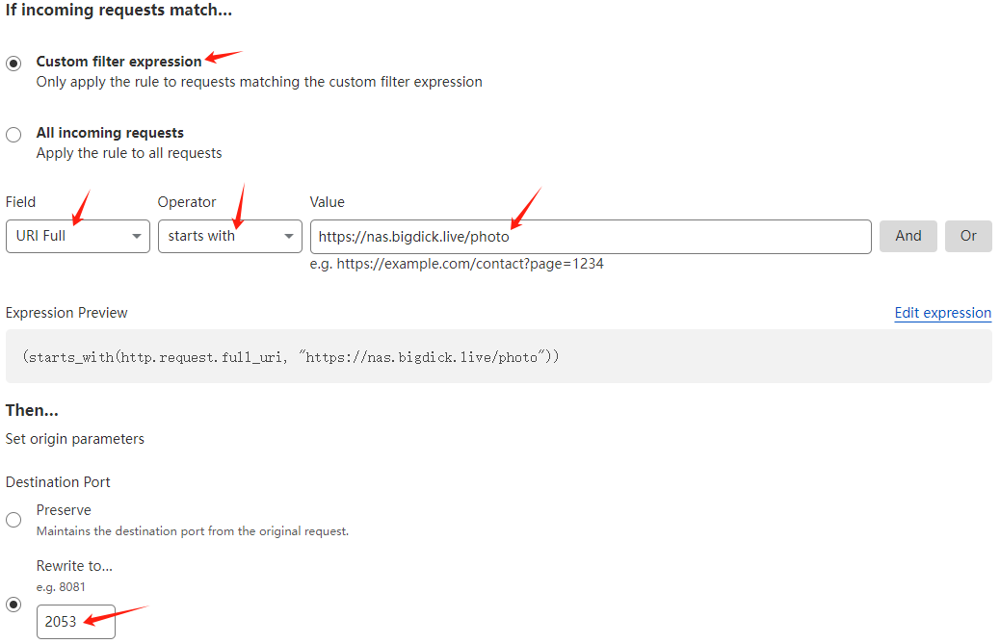
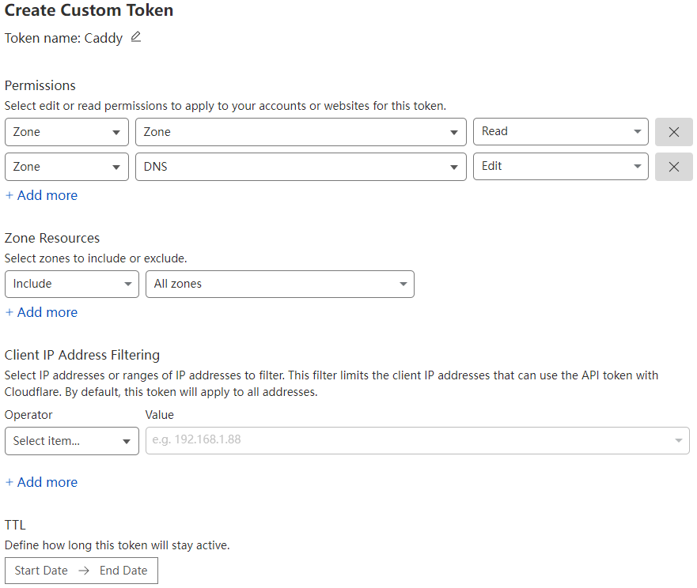

+++
title = "家用公网服务架设指引"
date = 2024-09-15
description = "和联通斗智斗勇的第10010天"

[taxonomies]
tags = ["CloudFlare", "中国联通", "光猫", "小米路由器", "4to6"]

[extra]
giscus = true
footnote_backlinks = true
quick_navigation_buttons = true
insert_anchor_links = "left"
toc = true
+++

## 太长不看

大家都是有**IPv6**的公网地址的，所以：

- **光猫**：打开IPv6支持，桥接模式
- **路由器**：native模式
- **CloudFlare（下简称CF）**：
  - 域名丢CF托管（按需决定是否走CF代理）
  - 按需添加规则
- **设备**：跑[ddns-go](https://github.com/jeessy2/ddns-go)
- **Caddy**：按需反代、自动HTTPS

## 光猫篇

这块长话短说，先抛出一个大前提：喜欢动手折腾的同学，能接受自购企业级光猫（中兴、华为等等均可）最好，恩山论坛上有备受推崇的几个型号及各种对比，我就不赘述了。

如果你一定要坚持光猫是运营商提供服务的载体，安装/调试/维护它是运营商工作的一部分，我只想提两个要点：

**第一**，**投诉**不能当时解决问题，但绝对是解决问题的**唯一**手段。

虽然某些运营商工作人员非常敷衍，但还是希望大家理性投诉，一个大的原则是先礼后兵，不要**越级**（投诉）：你不能让认真工作的人突然莫名其妙被领导敲打一下（甚至被扣钱），这很离谱。

经过了长达3个多月的拉锯战，问题终于得以解决[^1]，下面列举我实际的投诉（中国联通）顺序，供大家参考：

1. 先联系安装师傅（帮装宽带或者近期派工单的师傅）
2. （**省级**）打客服：10010
3. （**总部**）打集团投诉热线：10015 （**工作时间：08:30-17:30**）
4. [投诉到工信部](https://yhssglxt.miit.gov.cn/web/appealInformation)

要有长期作战的准备，因为直到投诉到工信部之前，可能还是之前总联系你的几个客服（话务员）和安装师傅在和你绕来绕去，反复让你**描述同样的问题**，再复述**完全不一致**的问题给你听，或者直接问你：

**您家宽带是上不了网了是吗？**

希望大家与人为善，因为他们也很无奈，case 来了就要接，想找技术好的人找不着。这就是GQ现状啊。

**第二**，光猫**当换则换**。

当你申请装宽带时，如果当地运营商有陈旧的存货，而你又没有提出要求，是可能优先给你装**旧光猫**的。
这些光猫的IPv6支持形同虚设。没错，你点进去（管理员账户）有相关的设置，但只能分配一个地址给你。
然后你就可以在IPv6的海洋中遨游了：你只能访问IPv6的服务而不能提供任何服务，因为**光猫的内置防火墙规则**给你干得死死的[^2]，又或者给设备发放地址的**前缀有问题**。

这些光猫有些共通特点：

- 设置界面中完全没有IPv6相关的防火墙设置
- 尚能发送WIFI信号[^3]

## 路由器篇

## CF篇

由于OMV没有特别爽的照片管理应用，所以我在NAS上安装了PhotoPrism（下简称**PP**）。

那么就催生了我对网络的以下几个需求：

- PP需要走HTTPS[^4]
- PP最好可以通过域名访问
- URL（子域名）最好容易记忆，不要有端口号等出现
- HTTP请求可以被重定向到HTTPS
- 仅在IPv4网络环境下亦可访问

下面分别展开叙述。

### 0. 域名绑定动态IPv6地址

先把域名托管到CF，这个不做赘述了。

然后开启一个[ddns-go](https://github.com/jeessy2/ddns-go?tab=readme-ov-file#docker%E4%B8%AD%E4%BD%BF%E7%94%A8)服务：

```yaml
services:
  ddns-go:
    image: jeessy/ddns-go
    restart: always
    network_mode: "host"
    volumes:
      - ./ddns-go:/root
```

Token的获取方式：



### 1. 在IPv4下访问

这步很简单，只要让域名走CF的代理就可以。



CF在全球范围内运营维护了大量同时支持IPv4/v6的边缘节点，并在其上应用负载均衡。经过这样的设置后，哪怕客户端的网络环境只支持IPv4，CF也会将其发送的请求代理到客户端附近的边缘节点上，而这些节点支持IPv6，这样就实现了`4` to `6`。

### 2. 端口映射

> 中国联通在上游禁用了以下端口（欢迎评论补充其他情况）：
> - 80
> - 443
> - 8080
> - 53

我们在[第**1**步](#1-zai-ipv4xia-fang-wen)中配置域名走了CF的代理，但CF的代理仅在[特定的几个端口](https://developers.cloudflare.com/fundamentals/reference/network-ports/#network-ports-compatible-with-cloudflares-proxy)上生效，因此只能充分利用它们。

比如，我决定用`/photo`子路径指向我NAS上的PP服务，并使用CF的`2053`端口来代理访问PP的HTTP请求：

**操作指引**：**Dashboard** → **Rules** → **Origin Rules** → **Create rule**



### 3. Caddy反向代理

> Caddy需要自行编译以增加对CF的支持，过程不再赘述，详见我[配置NAS的post中的对应部分](@/blog/nas/index.md#caddy)。

先去CF拿个给Caddy用的token。过程和[第**0**步](#0-yu-ming-bang-ding-dong-tai-ipv6di-zhi)中描述的类似，详细配置如下：



有了token后可以参照Caddy官方文档[配置daemon的环境变量](https://caddyserver.com/docs/running#environment-variables)。

然后写好`/etc/caddy/Caddyfile`：

```
{
    auto_https disable_redirects
}

nas.bigdick.live:2053 {
    reverse_proxy :2342

    tls {
        dns cloudflare {env.CF_API_TOKEN}
    }
}
```

这里详细解释一下为什么要在Caddy中禁用自动重定向到HTTPS：

- `80`和`443`端口都被运营商在上游禁用了
- 当然可以更改Caddy的[HTTP](https://caddyserver.com/docs/modules/http#http_port)和[HTTPS](https://caddyserver.com/docs/modules/http#https_port)的默认端口，但全局应用这些配置会影响到Caddy代理的其他服务
- 如果在[第`2`步](#2-duan-kou-ying-she)中同时转发HTTP和HTTPS的请求到两个不同的端口，则需要**两个**Origin Rules，复杂且不经济

重启Caddy生效：

```bash
systemctl daemon-reload
systemctl restart caddy
```

### 4. 使用CF将HTTP请求重定向至HTTPS

**操作指引**：**Dashboard** → **Rules** → **Redirect Rules** → **Create rule**

具体的设置就很简单了，匹配规则等和Origin Rules类似，按照页面指引填写并保存即可。

---

[^1]: 大概分享一下狗血过程：  
1. 先下单，派了个单，安装师傅说“**正在开三中全会**”，这种“敏感操作”搞不了
2. 我说师傅您给我管理员密码我自己配置成桥接
3. 桥接之后设备还是无法向公网提供IPv6服务，排查了路由器和操作系统的防火墙后确定是光猫问题
4. 打10010下了个新工单，向安装师傅反映光猫IPv6防火墙不可配置问题（我说给我SSH或者Telnet方式都行了）
5. （我理解是）安装师傅的领导敷衍他
6. 反复催促下安装师傅表示我们管不了，给了光猫厂家电话，说你直接问去
7. 不知道那个厂家是不是不做了，电话打不通
8. 开始投诉到10015
9. 接了大概20多个回访、问询和答复电话，当中有将近10次要从头描述问题（**您家宽带是上不了网了是吗？**）
10. 我要求提供光猫的操作手册或文档，客服又反馈去了
11. 皮球又提到步骤**4**的安装师傅身上，他表示我家用的光猫已经全线停止使用了
12. 我要求换光猫，所以师傅和我约了时间上门
13. 上门后他表示改不了桥接，问我借了笔记本电脑试图`telnet`去获取密码，但命令都打错了，大怒，叫我再下一个工单去问管理员密码
14. 我要来管理员密码之后终于可以自己配置了，问题最终得以解决

[^2]: 且每个厂家的的每个型号的光猫的SSH/TELNET方式均不同，也不面向宽带用户提供文档，难以复用经验

[^3]: 一些运营商的新光猫早就不发送WIFI了：**降低运营成本**

[^4]: 仅为PP的默认设定，但可以[关闭HTTPS](https://docs.photoprism.app/getting-started/config-options/#web-server)。照片这种涉及隐私的数据还是最好不要明文传输，因此我选择尊重PP的这一设定