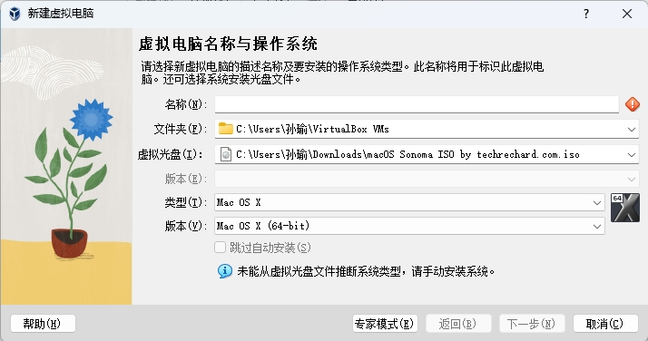

+++
title = "在VirtualBox里安装macOS"
date = 2024-07-07
description = "穷人没有苹果，却要调试苹果的程序，太痛苦了"

[taxonomies]
tags = ["黑苹果", "苹果", "iOS", "macOS", "虚拟机", "VirtualBox"]

[extra]
giscus = true
footnote_backlinks = true
quick_navigation_buttons = true
insert_anchor_links = "left"
toc = true
+++

## 镜像文件

可能我姿势不对，Sonoma是万万不行的，最后还是装了High Sierra。

我们只能用ISO：[下载链接](https://ia800409.us.archive.org/28/items/mac-os-high-sierra-10.13_202204/macOS%20HighSierra%2010.13.iso)（可能会失效，如果瓜了可以留言，我尝试传一份到其他地方）。

关于ISO和DMG的区别，以及如何从官方的DMG制作ISO镜像，可以参照[这篇post](https://iboysoft.com/howto/macos-sonoma-iso.html)。

## 创建虚拟机

下载安装最新的VirtualBox，不赘述了，但注意还要安装**Extension Pack**。

然后用头先的镜像文件创建虚拟机：



下面是一些关键设置。芯片组一定要选**ICH9**，并**启用EFI**：


至少给128M的显存，并且尽量**启用3D加速**：


还需要一些额外配置，需要先完全退出VirtualBox，然后**以管理员权限运行**PowerShell或者终端，定位到VirtualBox安装的位置（默认是下面的位置），执行几条命令：

```
cd "C:\Program Files\Oracle\VirtualBox\"
./VBoxManage.exe modifyvm "VM NAME" --cpuidset 00000001 000106e5 00100800 0098e3fd bfebfbff
./VBoxManage setextradata "VM NAME" "VBoxInternal/Devices/efi/0/Config/DmiSystemProduct" "iMac19,3"
./VBoxManage setextradata "VM NAME" "VBoxInternal/Devices/efi/0/Config/DmiSystemVersion" "1.0"
./VBoxManage setextradata "VM NAME" "VBoxInternal/Devices/efi/0/Config/DmiBoardProduct" "Iloveapple"
./VBoxManage setextradata "VM NAME" "VBoxInternal/Devices/smc/0/Config/DeviceKey" "ourhardworkbythesewordsguardedpleasedontsteal(c)AppleComputerInc"
./VBoxManage setextradata "VM NAME" "VBoxInternal/Devices/smc/0/Config/GetKeyFromRealSMC" 1
```

当中的`"VM NAME"`替换成创建虚拟机时设置的名字即可。

然后重新打开VirtualBox的界面，选中头先创建的苹果虚拟机，尝试安装系统[^1]。

接下来还可能遇到一个恶心的问题，我忘了截图，大概是说程序已损坏，这个时候要断开host的网络，关掉时间自动同步，手动设置时间到2017年（High Sierra发行的年份）。

效果图：


折腾一圈下来觉得用起来太卡了，刚好手边还有一台CPU和集显适配的小电脑，还是决定搞一个黑苹果。

[^1]: 可能会出现如下图的报错：

[据说](https://www.reddit.com/r/VFIO/comments/tkqsx4/comment/kc78it0/?utm_source=share&utm_medium=web3x&utm_name=web3xcss&utm_term=1&utm_content=share_button)是BIOS中Hyper-V设置的问题（也可能直接就不支持Hyper-V），我暂时没时间验证，改成
```
./VBoxManage setextradata "VM NAME" "VBoxInternal/Devices/smc/0/Config/GetKeyFromRealSMC" 0
```
后可以正常启动了。