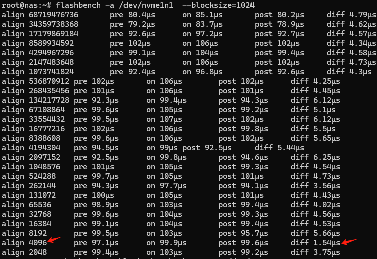

+++
title = "家用NAS配置指北"
date = 2024-06-13
description = "基于OMV7"

[taxonomies]
tags = ["NAS", "OMV"]

[extra]
giscus = true
footnote_backlinks = true
quick_navigation_buttons = true
insert_anchor_links = "left"
toc = true
+++

## 建议材料

| 类别 | 型号 | 理由 |
| - | - | - |

## OS配置

OMV安装完毕后，暂时不要在UI里更新系统。尽管安装过程可能按照指引已经配置了国内的Apt源，但有些（比如Debian Security）未覆盖到，会导致`apt update`等速度非常慢。

因此建议先[配置镜像](https://help.mirrors.cernet.edu.cn/OpenMediaVault/#%E6%9B%BF%E6%8D%A2-open-media-vault-%E9%95%9C%E5%83%8F%E6%BA%90)。

## 容器运行环境

为方便管理容器和Docker Compose部署的服务等，还是要装一下`openmediavault-compose`这个插件。

官方文档建议先安装OMV-Extras，然后就可以在界面里操作安装Docker CE。但事实上两者并无强绑定关系。

虽然但是，如果添加了OMV-Extras的源，在界面中可以方便查看各种插件的安装状态，会提供一定的方便。还是鼓励装一下：

> 涉及GayHub的资源，最好还是加个反代来用，这里我选了<https://kkgithub.com>

```bash
wget -O - https://kkgithub.com/OpenMediaVault-Plugin-Developers/packages/raw/master/install | sed 's/github/kkgithub/g' | bash
```

这里装完就装完了，在国内就别指望用它来装Docker等等。

接下来，就是使用国内的Docker CE镜像来安装Docker。装好后设置镜像/反代方便拉取images。

最后来到`openmediavault-compose`插件：

```bash
apt install openmediavault-compose
```

另外，一些插件（比如`openmediavault-photoprism`）用到Podman。

但照旧要[配置国内镜像](https://podman.io/docs/installation#registriesconf)。

## 文件系统

文件系统我选了Btrfs[^1]。

我认为Btrfs是拥抱未来的文件系统，虽然当下尚有很多缺陷（比如社区报告的RAID5/6不稳定等），但把RAID、LVM等功能集成到文件系统中是大势所趋。

虽然使用它自带的RAID0/1/10或者`DUP`模式都是安全的，但我嫌弃这些方案：要么磁盘利用率低，要么不安全。

所以最后还是用`openmediavault-md`做了软RAID。然后Btrfs在RAID后的卷上创建，模式选了`Single`。

但默认的挂载参数不够理想。最后采取了如下设置[^2]：

```bash
omv-env set -- OMV_FSTAB_MNTOPS_BTRFS "defaults,nofail,compress=zstd,autodefrag,noatime"
monit restart omv-engined
omv-salt stage run prepare
omv-salt stage run deploy
```

## bcache缓存

> 我是使用了一段时间才苟到一块NVMe做缓存盘的。如果文件系统上有数据，理应先[备份全盘](https://wiki.omv-extras.org/doku.php?id=omv7:utilities_maint_backup#full_disk_mirroring_backup_with_rsync)。  
> 理论上用[blocks](https://github.com/g2p/blocks)工具直接转换也是可以的，但依赖环境看着很吓人。

### 确认SSD的erase block size

创建高速缓存的时候尽量还是尊重一下SSD固有的erase block size，这样可以减少[write amplification](https://en.wikipedia.org/wiki/Write_amplification)现象的发生。但多数SSD的参数规格中并未提及这点，如果不想将就，可以用[flashbench](https://github.com/bradfa/flashbench)工具去猜。

安装flashbench：

```bash
apt install flashbench
```

猜：

```bash
# 建议先写入一定量的随机数据，猜起来准一些
# dd if=/dev/urandom of=/dev/nvme1n1 bs=4096 status=progress
flashbench -a /dev/nvme1n1  --blocksize=1024
```

在我的case里，虽然pattern不甚明显，还是值得参考的：



### 配置缓存

bcache已经并入内核很久了，但还是需要安装`bcache-tools`来配置：

```bash
apt install bcache-tools
```

先擦除文件系统，若出现`Device or resource busy`错误请参照[这节](#device-or-resource-busy)：

```bash
wipefs -a /dev/md0
wipefs -a /dev/nvme1n1
```

然后格式化后端和缓存设备[^3]：

```bash
# 这里会创建/dev/bcache0
make-bcache --data-offset 1290240k -B /dev/md0
make-bcache --bucket 4M -C /dev/nvme1n1
```

搞定后检查一下uuid，并将其绑定至`/dev/bcache0`:

```bash
bcache-super-show /dev/nvme1n1 | grep cset
echo 9b72f96d-7e85-4fd3-a78f-a283504b938c > /sys/block/bcache0/bcache/attach
```

### 后续配置

到这里就可以在UI中创建Btrfs分区并且挂载了。

检查状态：

```bash
cat /sys/block/bcache0/bcache/state
```

如果返回内容是`clean`，说明一切正常。

修改为只用于读缓存：

```bash
echo writearound > /sys/block/bcache0/bcache/cache_mode
```

### Device or resource busy

进行配置过程中常见`Device or resource busy`错误。针对不同的对象，有不同的处理方式。

#### 高速缓存盘

```bash
echo 1 > /sys/fs/bcache/9b72f96d-7e85-4fd3-a78f-a283504b938c/unregister
```

#### 后端低速盘

在擦除文件系统之前，后端低速盘往往已经挂载并有服务相关联，首先要先停止服务并解挂载。

如果盘已经被配置作为bcache后端，则需要先停掉：

```bash
echo 1 > /sys/block/bcache0/bcache/stop
```

## 新建用户

在新建好的Btrfs分区上创建一个`home`目录作为用户的家目录。

新建用户时不选择用户组，则默认会赋予一个`users`的组，一般来讲权限足够用。

## PhotoPrism

PhotoPrism（下简称**PP**）虽然可以在UI里选择`openmediavault-podman`安装，但事实上由于连接速度的问题，`podman pull`拉取images的过程会非常长且在UI里没有正常的进度显示。

这会大大增长（心理上的）不确定性，因此还是建议命令行安装：

```bash
apt install openmediavault-photoprism
```

安装完毕后可以在UI中设置将其启动起来，建议按照[官方文档](https://docs.photoprism.app/getting-started/nas/openmediavault/)中截图方式设置（目录需预先创建）：


## Caddy

PP如果想在公网访问需要通过SSL加密的连接，我选用Caddy来做反代。

这里因为PP已经在Podman下跑起来了，最理想的路线就是在host上直接跑Caddy[^4]。

定制Caddy（带[CF插件](https://github.com/caddy-dns/cloudflare)去编译）：

```bash
# 苟一下七牛云的CDN
go env -w GO111MODULE=on
go env -w  GOPROXY=https://goproxy.cn,direct
xcaddy build --with github.com/caddy-dns/cloudflare
```

然后就可以删掉Go了：

```bash
rm -rf /usr/local/go && rm -rf ~/go*
```

为了使Caddy能提供稳定的代理，可以按照[官方文档](https://caddyserver.com/docs/running#linux-service)创建service。

最后，为了让PP能够正确处理web请求，需要将配置好的地址绑定上：

```bash
omv-env set -- OMV_PHOTOPRISM_APP_CONTAINER_START_OPTIONS "-e PHOTOPRISM_SITE_URL=http://localhost:2342/photo"
omv-salt stage run prepare
omv-salt deploy run photoprism
```

---

[^1]: 各文件系统对比：<https://en.wikipedia.org/wiki/Comparison_of_file_systems>

[^2]: OMV的文件系统环境变量：<https://docs.openmediavault.org/en/stable/various/fs_env_vars.html>  
Btrfs挂载选项：<https://btrfs.readthedocs.io/en/latest/btrfs-man5.html#mount-options>

[^3]: 如果全程按照本文配置，那就没必要在意`--data-offset`的值了。  
这是因为OMV中通过UI创建的RAID5的stripe size默认是`512`k。可以通过如下命令查看：

```bash
mdadm -D /dev/mdX | grep Chunk
```

如果RAID是通过其他方式创建的，那么可以参考[内核文档](https://docs.kernel.org/admin-guide/bcache.html#troubleshooting-performance)里的叙述去计算这个数值。

[^4]: 我有设想和尝试过把Caddy也放在容器里运行，直接的想法就是由于Podman和Docker的容器网络互不联通，所以需要将Caddy也用Podman跑起来。

> 当然也可以把PP和Caddy都用Docker跑，把`podman build`替换成`docker build`就可以，但OMV既然已经提供了插件，就费事自己去抄作业/改作业了。

也可以在制作镜像时用代理：

**`Dockerfile`**

```dockerfile
FROM caddy:builder-alpine AS builder

RUN xcaddy build \
    --with github.com/caddy-dns/cloudflare

FROM caddy:alpine

COPY --from=builder /usr/bin/caddy /usr/bin/caddy
```

```bash
podman build \
    --build-arg "HTTP_PROXY=http://192.168.31.151:7890" \
    --build-arg "HTTPS_PROXY=http://192.168.31.151:7890" \
    --build-arg "NO_PROXY=localhost,127.0.0.1" \
    -t caddy:cf .
```

由于[同个pod间的网络才是互通的](https://docs.redhat.com/zh_hans/documentation/red_hat_enterprise_linux/9/html/building_running_and_managing_containers/proc_communicating-between-two-containers-in-a-pod_assembly_communicating-among-containers)，所以先确认已经跑起来的`photoprism-app`属于哪个pod：

```bash
podman ps --pod
```

然后尝试在`photoprism`这个pod里启动Caddy：

```bash
podman run -d --pod photoprism --name photoprism_caddy \
    -v caddy_data:/data \
    -v caddy_config:/config \
    -v $PWD/Caddyfile:/etc/caddy/Caddyfile \
    -e CF_API_TOKEN=the_fucking_token \
    caddy:cf
```

到这里就不对劲了，因为同一 pod 中的所有容器共享端口映射规则，我们没办法为 Caddy 指定新的映射规则，也就意味着没有端口给它用了，那还转发个锤子的host流量，这条路走不通。