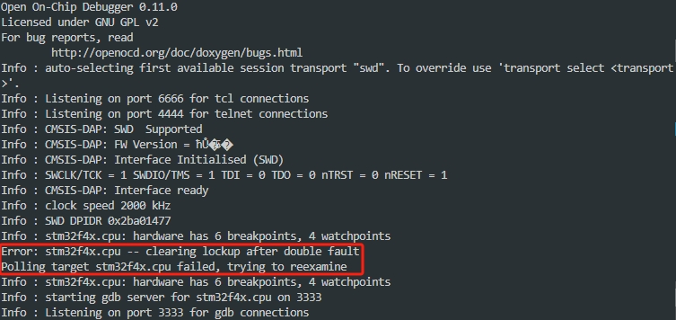

+++
title = "Rust单片机编程：用一块STM32板发送http请求"
date = 2024-01-29
description = "记录从0开始在STM32F407上编写Rust实现HTTP GET。"

[taxonomies]
tags = ["Rust", "单片机", "嵌入式", "Web"]

[extra]
giscus = true
footnote_backlinks = true
quick_navigation_buttons = true
insert_anchor_links = "left"
toc = true
+++

> 本文多处参考了[The Embedded Rust Book](https://docs.rust-embedded.org/book/)，建议对Rust嵌入式开发尚不熟悉的同学反复观看这本书。  
> 由于例子使用的开发板为[STM32F3DISCOVERY](https://docs.rust-embedded.org/book/intro/hardware.html#stm32f3discovery-the-f3)，与[我们的](#shi-yan-cai-liao)有一定区别，因此各种操作与书中提及多有出入，**以本文为准**。

## 实验材料

- 一块STM32F407板，板载WIFI模块（ESP8266）
- 服务器：Ubuntu 22.04.1，非常多的USB 3.0/3.1接口，无图形界面

## 环境配置

在一切开始之前，首先使用合适的Type-C线将服务器的任一USB口与板子的CMSIS-DAP接口连接。

基本的编译、烧写和调试（仿真等）环境可以参照[这一章节](https://docs.rust-embedded.org/book/intro/install/linux.html)配置，此处仅列举需要修改的步骤和有必要补充的信息：

### 自定义`udev`规则

> 注意：这一小节与*The Embedded Rust Book*出入非常大

我们希望OpenOCD等在不需要root权限的情况下就可以自由与开发板通讯，因此需要自定义`udev`的规则。运行`lsusb`命令列出USB设备信息，我们可能获得类似如下的内容：

```
Bus 004 Device 001: ID 1d6b:0003 Linux Foundation 3.0 root hub
Bus 003 Device 001: ID 1d6b:0002 Linux Foundation 2.0 root hub
Bus 002 Device 002: ID 174c:3074 ASMedia Technology Inc. ASM1074 SuperSpeed hub
Bus 002 Device 001: ID 1d6b:0003 Linux Foundation 3.0 root hub
Bus 001 Device 007: ID c251:f001 Keil Software, Inc. CMSIS-DAP
Bus 001 Device 002: ID 174c:2074 ASMedia Technology Inc. ASM1074 High-Speed hub
Bus 001 Device 001: ID 1d6b:0002 Linux Foundation 2.0 root hub
```

这里注意**行末**设备名为`CMSIS-DAP`的设备即为我们的板子[^1]。我们以这行为例，解读一下`lsusb`返回内容的含义：

- **Bus 001**：表示设备连接到`001`号总线
- **Device 007**：表示这是连接到该总线上的第`007`号设备
- **ID c251:f001**: 这里的ID分为两部分：第一部分是`idVendor`（设备产商），值为`c251`;第二部分为`idProduct`（设备类型编号），值为`f001`

有了`idVendor`和`idProduct`，接下来我们需要在`/etc/udev/rules.d/70-st-link.rules`文件里追加一行（若无文件则新建）[^2]：

```
# OWNER的值请填写开发者自己使用的用户名
ATTRS{idVendor}=="c251", ATTRS{idProduct}=="f001", OWNER="ysun"
```

写好规则后使用下述命令应用（**无需拔掉设备重新插上**）：

```bash
# 这里的action参数至关重要
# 如果不指定它的值为change，内核会通知udev将所有设备都认作新设备
# 这可能有非常恶劣的影响
sudo udevadm control --reload-rules && sudo udevadm trigger --action=change
```

### 编译安装OpenOCD

*The Embedded Rust Book*中的指引为[使用包管理器直接安装OpenOCD](https://docs.rust-embedded.org/book/intro/install/linux.html#packages)。

但对于某些情况，比如我们的Ubuntu 22.04.1，通过`apt`安装的OpenOCD为v0.11.0版本。

这一版对STM32F4x系列的支持还比较糟糕，因此**墙裂建议**手动编译一下最新的OpenOCD以防止犯病：

```bash
# 安装（编译时）必需依赖
sudo apt install libtool libhidapi-dev libusb-1.0-0-dev
git clone https://github.com/openocd-org/openocd.git && cd openocd
./configure --enable-cmsis-dap
make
sudo make install
```

### 环境验证

为检验工具和驱动是否已被正确配置，我们需要验证OpenOCD能否正常工作（与板上自带的ST-Link调试硬件通信）。在项目根目录下创建`openocd.cfg`文件，并写入:

```cfg
# 设备接口配置文件
source [find interface/cmsis-dap.cfg]
# 理论上udev规则配置好可以自动获取到，若不能则可以手动指定：
# cmsis_dap_vid_pid 0xc251 0xf001
# 这是一个历史遗留问题，其实是CMSIS-DAP v2 bulk interface自动检测的bug
# 对于一些v1的设备会误被判做是v2，导致通信失败，详见这个commit：
# https://github.com/openocd-org/openocd/commit/3da0c2504c14ea0736b973fa0b5085c42a9c6ce8
# 该bug在v0.12.0被修复，对之前的版本可以加上下面这行
# cmsis_dap_backend hid
# 目标芯片配置文件
source [find target/stm32f4x.cfg]
```

此时，运行`openocd`，应该会有类似输出：

```
Open On-Chip Debugger 0.11.0
Licensed under GNU GPL v2
For bug reports, read
        http://openocd.org/doc/doxygen/bugs.html
Info : auto-selecting first available session transport "swd". To override use 'transport select <transport>'.
Info : Listening on port 6666 for tcl connections
Info : Listening on port 4444 for telnet connections
Info : CMSIS-DAP: SWD  Supported
Info : CMSIS-DAP: FW Version = ħŮ�Ƽ�
Info : CMSIS-DAP: Interface Initialised (SWD)
Info : SWCLK/TCK = 1 SWDIO/TMS = 1 TDI = 0 TDO = 0 nTRST = 0 nRESET = 1
Info : CMSIS-DAP: Interface ready
Info : clock speed 2000 kHz
Info : SWD DPIDR 0x2ba01477
Info : stm32f4x.cpu: hardware has 6 breakpoints, 4 watchpoints
Info : starting gdb server for stm32f4x.cpu on 3333
Info : Listening on port 3333 for gdb connections
```

并且程序阻塞住了控制台。

至此环境配置完毕。

## 仿真

> 在开始仿真调试前，建议先用`cargo-generate`[从模板仓库开始初始化一个实验项目](https://docs.rust-embedded.org/book/start/qemu.html#using-cargo-generate)。

仿真大致操作与*The Embedded Rust Book*无异，但由于我们的板子是STM32F4x，故QEMU的参数要做一定调整。

比如，`.cargo/config.toml`中需要增加这些内容：

```toml
[target.thumbv7em-none-eabihf]
runner = "qemu-system-arm -cpu cortex-m4 -machine netduinoplus2 -nographic -semihosting-config enable=on,target=native -kernel"

[build]
target = "thumbv7em-none-eabihf"
```

然后就可以正常仿真了（会隐式地以上述参数调用QEMU）：

```bash
cargo run --example hello --release
```

如果需要用GDB调试，只需要将启动QEMU的参数如上述`.cargo/config.toml`文件中替换即可。

## 上硬件

### 内存布局

这部分最重要的就是搞清楚板子的内存布局，要确定Flash和SRAM的起始点和长度以确保编译和运行时的行为正确。

> 主要参照ST的[RM0090文档（Rev 19）](https://www.st.com/resource/en/reference_manual/rm0090-stm32f405415-stm32f407417-stm32f427437-and-stm32f429439-advanced-armbased-32bit-mcus-stmicroelectronics.pdf)。

#### 太长不看

在项目根目录的memory.x文件中，写入：

```ld
MEMORY
{
  /* NOTE 1 K = 1 KiBi = 1024 bytes */
  /* TODO Adjust these memory regions to match your device memory layout */
  /* These values correspond to the LM3S6965, one of the few devices QEMU can emulate */
  FLASH : ORIGIN = 0x08000000, LENGTH = 512K
  RAM : ORIGIN = 0x20000000, LENGTH = 128K
}
```

详细依据见下文。

#### Flash布局

架构图在第**73**页：


我们可以看到，从interface到memory是一条总线连接的，即主内存在使用上是不分区的，即Flash的长度应为**所有Sector的大小之和**。为了提升性能，对指令码和数据码各自有对应的cache，但不影响主内存的分布。

因此参照表[^3]：


~~Flash应为从`0x08000000`开始，到`0x080FFFFF`结束。用末尾减去开头，刚好是`1024`K。~~

但上述其实不过是对最高配置的介绍，并非所有的STM32F40x都有高达`1`M的实际Flash大小，具体仍要参照型号：


由于我们的板子的详细型号是STM32F407VET6，因此Flash只有`512`K。

#### SRAM布局

参照第**68**页的描述：


由于我们的板子不存在SRAM3，所以SRAM的起始地址应为`0x20000000`。Backup SRAM只在特殊的电压条件下才会被调用，~~因此SRAM的长度应标注为`192`K~~。

但在编译时，还应结合板子的整体架构考虑：


在文字描述中高达`192`K的“系统”SRAM当中其实还包含了只能经由D-bus主线直接与MCU通信的、大小为`64`K的CCM内存。

因此实际**在编译时可以声明的内存大小**只有`192` - `64` = `128`K。

## ESP8266篇

待续。

## 其他选择

[STM32CubeIDE](https://www.st.com/content/st_com/zh/stm32cubeide.html)也许是不错的一体化集成开发环境。

## 常见问题

### 0. 为什么已经插在USB上了，但`lsusb`看不到板子？

可能接错到USB-Slave接口上了。可以用`sudo dmesg`查看详细日志：


### 1. 使用GDB调试时出现内存错误

如果内存布局设置错误或有严重的编程失误导致内存错误，可能会在OpenOCD输出中看到类似如下报错：

```
Error: Failed to read memory at 0x2002ffd0
```

同时GDB也会反馈类似内容：

```
0x080013aa in cortex_m_rt::HardFault_ (ef=0x0) at src/lib.rs:563
563             atomic::compiler_fence(Ordering::SeqCst);
```

可能板子被锁住：



出现这种情况时，请首先[确认内存布局正确](#srambu-ju)。

> 注意，更改`memory.x`文件后需要重新`cargo build`，这点在The Embedded Rust Book中[也有提及](https://docs.rust-embedded.org/book/start/hardware.html#configuring)。

另外，建议使用[最新版本的OpenOCD](#bian-yi-an-zhuang-openocd)，可能在重新开启OpenOCD进程或烧写程序（GDB的`load`指令）时自动解锁。

如果仍被锁住，则可按照如下步骤处理：

1. 开启一个`openocd`进程与板子连接
2. 在另外一个终端里使用`telnet`与`openocd`通讯：
  ```bash
  telnet localhost 4444
  ```
3. 在telnet提示符下尝试解锁：
  ```
  stm32f4x unlock 0
  ```
  如果顺利的话，会出现如下提示：
  ```
  stm32f2x unlocked.
  INFO: a reset or power cycle is required for the new settings to take effect.
  ```
4. 在telnet提示符下继续输入`shutdown`，然后将板子断电再通电。
5. 如果上述过程无效，尝试在telnet提示符下使用下面的命令彻底擦除Flash存储中的内容：
  ```
  stm32f4x mass_erase 0
  ```
  然后重复第**4**步。

### 2. `cargo build`报错：cannot find linker script memory.x

无论当前项目是否有子crates、目录如何组织，`memory.x`必须位于项目的根目录下（和最外层的`Cargo.toml`同级）[^4]。

确实有一种特殊情况可以不提供`memory.x`文件：项目代码中直接引入了BSC (Board Support Crate)，比如[stm32f3-discovery](https://crates.io/crates/stm32f3-discovery)。除此之外，使用属于其他抽象级别的crates都必须为`cortex-m-rt`的编译提供`memory.x`[^5]。

[^1]: 这里只看到`CMSIS-DAP`，没有看到STM32相关的信息。`sudo dmesg`可以在日志中看到细节：


  
[^2]: 这里文件名不是必需为`70-st-link.rules`，但建议前缀的数字要大于`50`，否则有可能覆写操作系统的一些默认规则。
有关`udev`规则，详见[这篇指南](https://www.reactivated.net/writing_udev_rules.html)。

[^3]: 头几个sector的大小比较小是因为许多板子并未达到`1`M的Flash大小，因此只有头几个sector，后面较大的则被舍弃了。  
这样的设计使得不同型号的板之间的sector布局尽量保持一致，程序移植的兼容性比较好。

[^4]: https://github.com/rust-lang/cargo/issues/9537

[^5]: https://docs.rust-embedded.org/book/start/registers.html#memory-mapped-registers